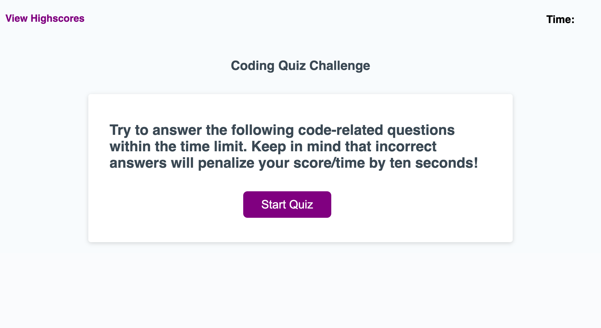

# cool-codequiz

The assignment was to create a timed quiz in which scores were stored. I created the html, css, and script files. After styling, I added functions to start the timer and quiz once the start button is clicked. If the answer to a question is correct, 10 points are added to the score. If the answer is incorrect, no points are added and 10 seconds are removed from the timer. When no time and/or questions are left, the game ends. Once the game ends, users can save their initials and scores. They can also vew other scores, clear scores, and start over. 

## Submission
GitHub Repo URL: https://github.com/hasnafar/cool-codequiz
Deployed URL: https://hasnafar.github.io/cool-codequiz/

 
